# Working Functionalities of SwasthyaSync HMS

**Product Name:** SwasthyaSync  
**Version:** 1.0.0  
**Document Type:** Working Functionalities Reference  
**Technology Stack:** React 18 (Vite) · Node.js (Express) · PostgreSQL  
**Date:** June 2026

---

## Table of Contents

1. [System Overview](#1-system-overview)
2. [Authentication & Access Control](#2-authentication--access-control)
3. [Landing Page & Public Portal](#3-landing-page--public-portal)
4. [Dashboard & Analytics](#4-dashboard--analytics)
5. [Patient Administration](#5-patient-administration)
6. [Inpatient Department (IPD)](#6-inpatient-department-ipd)
7. [Ward Management](#7-ward-management)
8. [Nursing Station](#8-nursing-station)
9. [Emergency Module](#9-emergency-module)
10. [Appointments & Scheduling](#10-appointments--scheduling)
11. [Clinical Modules](#11-clinical-modules)
12. [Laboratory Information System (LIS)](#12-laboratory-information-system-lis)
13. [Radiology Information System (RIS)](#13-radiology-information-system-ris)
14. [Pharmacy Management](#14-pharmacy-management)
15. [Blood Bank](#15-blood-bank)
16. [Operation Theatre (OT)](#16-operation-theatre-ot)
17. [Billing & Revenue Cycle](#17-billing--revenue-cycle)
18. [Inventory Management](#18-inventory-management)
19. [Staff Management](#19-staff-management)
20. [Settings & Hospital Configuration](#20-settings--hospital-configuration)
21. [Form Templates (Admin)](#21-form-templates-admin)
22. [Audit Log](#22-audit-log)
23. [Reports & MIS](#23-reports--mis)
24. [Technical Architecture](#24-technical-architecture)

---

## 1. System Overview

SwasthyaSync is a full-stack, cloud-native **Hospital Management System (HMS)** designed to digitise and unify all hospital workflows into a single integrated platform. The system covers **40+ hospital modules** spanning patient registration, clinical care, diagnostics, pharmacy, billing, revenue cycle, and administration.

### High-Level System Architecture

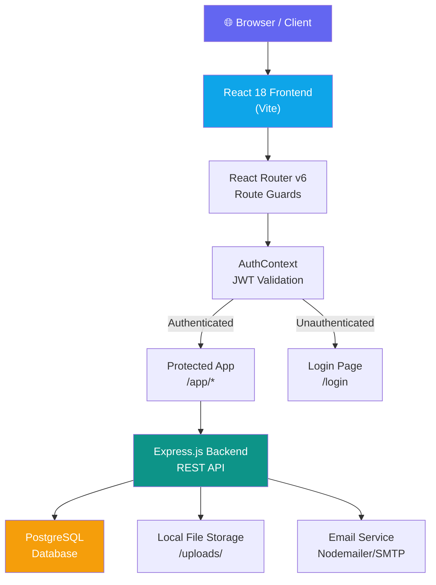

### Key Highlights

| Feature | Details |
|---|---|
| Modules | 40+ fully integrated hospital modules |
| Compliance | NABH documentation standards, Insurance audit trails |
| Access | Role-based access control (Admin / Staff) |
| Security | JWT-based authentication, encrypted credentials |
| PDF Generation | Built-in lab reports, discharge summaries, invoices |
| Form System | PDF annotation engine for hospital consent forms |
| Deployment | Docker-ready, Vite-built frontend, Express backend |

### Module Category Map

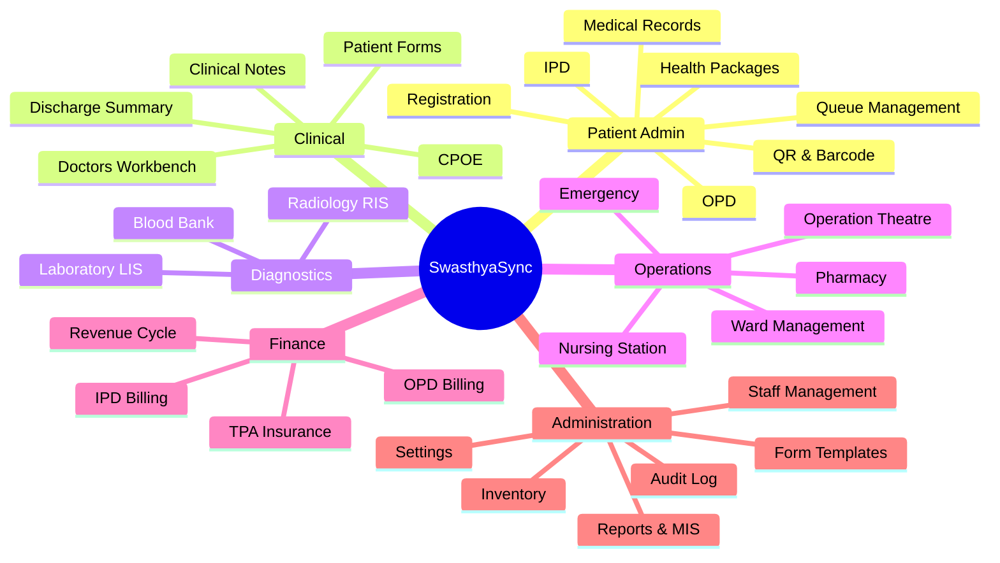

---

## 2. Authentication & Access Control

### Authentication Flow

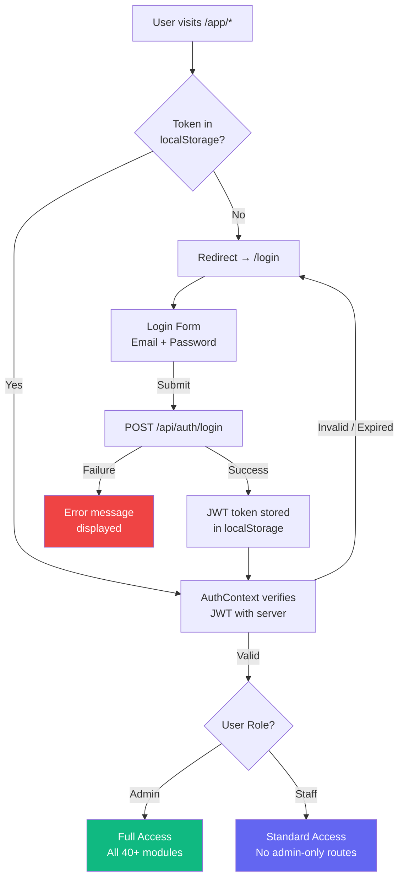

### 2.1 Login

- Email + password authentication
- JWT tokens issued on login and stored in browser `localStorage`
- Token verified on every protected route via `AuthContext`
- Automatic redirect to `/login` for unauthenticated sessions
- Loading state prevents flash of unauthenticated content

### 2.2 Registration

- New hospital/user registration form
- Fields: Hospital name, user name, email, password, confirm password
- Password hashing handled server-side (bcrypt)

### 2.3 Role-Based Access Control

| Role | Access |
|---|---|
| **Admin** | All modules including Staff Management, Form Templates, Audit Log |
| **Staff** | All clinical and operational modules; admin sections blocked |

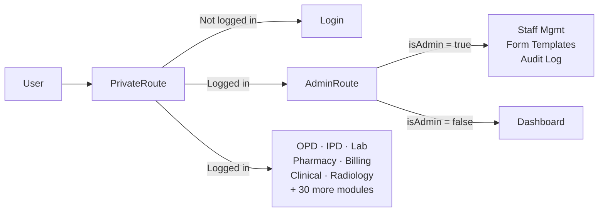

---

## 3. Landing Page & Public Portal

The public-facing landing page markets SwasthyaSync to hospital decision-makers.

### Page Structure Flow

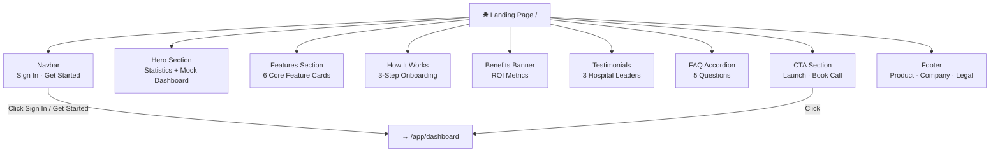

### Sections

1. **Navbar** — Sticky, scrolled-aware header with logo, navigation links, Sign In / Get Started CTAs
2. **Hero Section** — Headline with animated stat cards (mock dashboard preview)
   - Stats: 40+ Modules, 500+ Hospitals Served, 99.9% Uptime, 2× Faster Discharges
3. **Features Section** — 6 core feature cards with icons
4. **How It Works** — 3-step onboarding guide (Register → Go Live → Measure)
5. **Benefits Banner** — Dark section with ROI metrics (Rs 25L+ annual savings for 100-bed hospital)
6. **Testimonials** — 3 testimonial cards from hospital leaders
7. **FAQ** — 5 accordion-style questions covering modules, ROI, security, compliance
8. **CTA Section** — "Launch Live System" and "Book a Discovery Call" buttons
9. **Footer** — Product, Company, and Legal link columns

---

## 4. Dashboard & Analytics

The main authenticated landing page provides hospital-wide at-a-glance metrics.

### Dashboard Data Flow

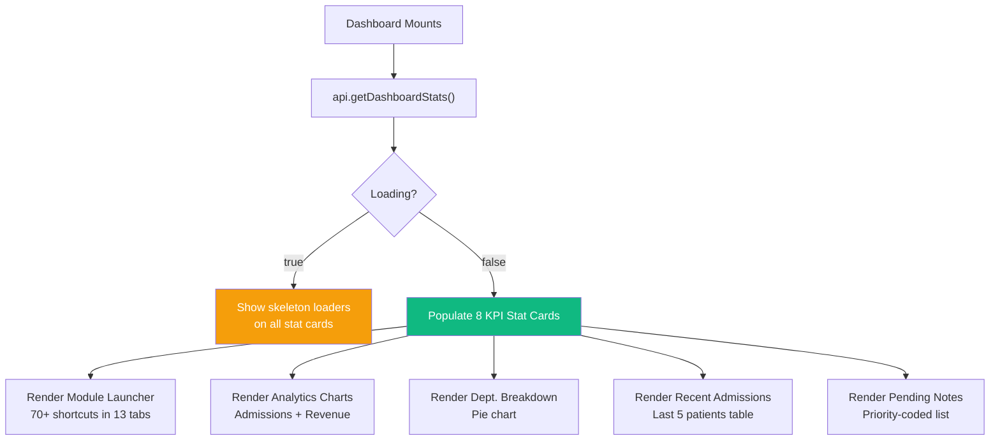

### 4.1 KPI Stat Cards (2 rows × 4 cards)

| Metric | Description |
|---|---|
| Total Patients | All patients registered in the system |
| Bed Occupancy | Current % with bed detail (occupied/total) |
| Pending Notes | Clinical notes awaiting digitisation |
| Today OPD | Outpatient visits today |
| Revenue (Month) | Monthly billed revenue vs. last month |
| Pending Lab Tests | Lab orders awaiting results |
| Critical Patients | Patients flagged as critical |
| Today Revenue | Billing amount generated today |

### 4.2 Module Launcher (13 Category Tabs)

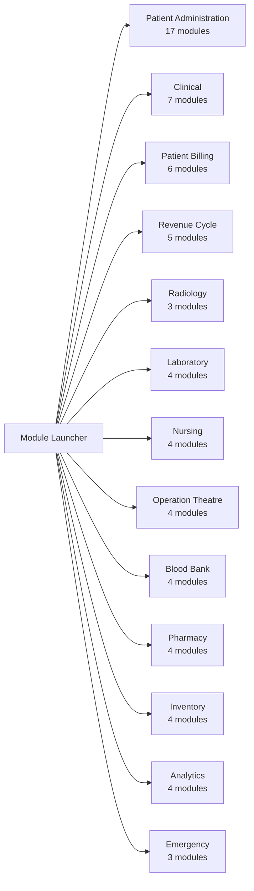

### 4.3 Analytics Charts

- **Admissions Overview** — Area chart, IPD vs OPD last 7 days (Recharts)
- **Monthly Revenue** — Bar chart, last 6 months revenue in Lakhs
- Toggle between Admissions and Revenue views

---

## 5. Patient Administration

### 5.1 Patient Registration

#### Overall Patient Lifecycle

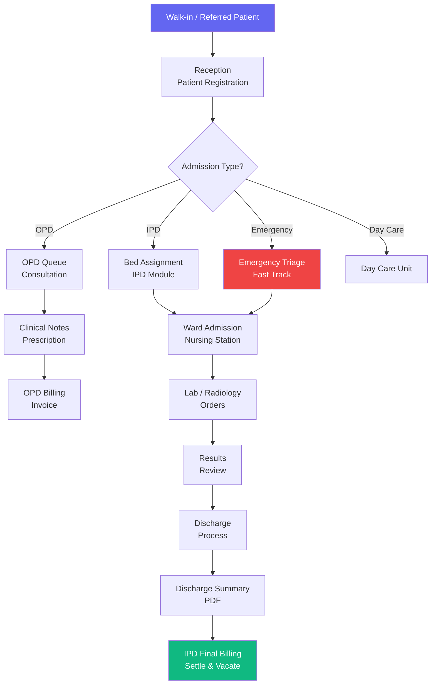

#### New Patient Registration — 4-Step Wizard

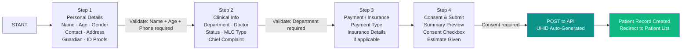

**Step 1 — Personal Details**

| Field | Details |
|---|---|
| Full Name | Required |
| Admission Type | OPD / IPD / Emergency / Day Care / ICU Direct |
| Age | Numeric |
| Date of Birth | Date picker |
| Gender | Male / Female / Other / Prefer not to say |
| Blood Group | A+/A-/B+/B-/AB+/AB-/O+/O-/Unknown |
| Marital Status | Single / Married / Widowed / Divorced / Separated |
| Religion | Hindu / Muslim / Christian / Sikh / Jain / Buddhist / Other |
| Mobile Number | Required, 10-digit |
| Alternate Mobile | Optional |
| Email | Optional |
| Address | Street, city, state (all Indian states), PIN code |
| Aadhaar Number | Optional |
| ABHA Health ID | 14-digit ABHA number |
| Guardian Name / Relation / Phone | Emergency contact |

**Step 2 — Clinical Info**

| Field | Details |
|---|---|
| Department | 30+ departments (General Medicine, ICU, Cardiology, etc.) |
| Attending Doctor | Dropdown from registered doctors |
| Initial Status | Stable / Critical / Recovering / Under Obs / Serious |
| Patient Category | General / BPL / Senior Citizen / Divyangjan / VIP, etc. |
| Referred By | Referring doctor/hospital name |
| Chief Complaint | Free-text textarea |
| MLC Type | None / Road Accident / Assault / Poisoning / Burns / Sexual Assault / Suicide Attempt / Industrial Accident / Other |
| Police Station / FIR | Visible only if MLC type is not "None" |

**Step 3 — Payment / Insurance**

| Field | Details |
|---|---|
| Payment Type | Self Pay (Cash) / Self Pay (UPI/Card) / Insurance / CGHS / ECHS / ESI / Ayushman Bharat / State Scheme / Govt / Free |
| Insurance Company | Visible for Insurance/TPA payment type |
| TPA Name | Third-party administrator |
| Policy / Member ID | Policy number |
| Policy Validity | Date picker |

#### Patient Detail Side Panel — Tab Flow

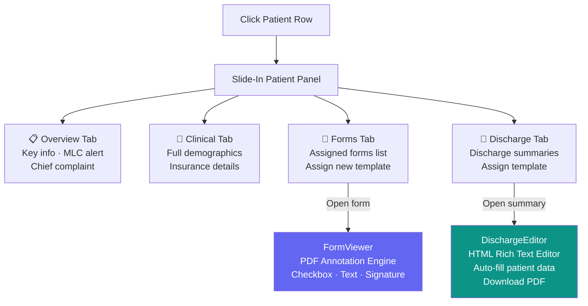

### 5.2 OPD Management

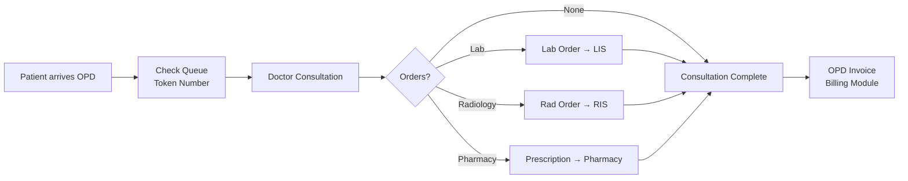

### 5.3 Queue Management

- Real-time patient queue for OPD consultations
- Queue position tracking
- Department-wise queuing

### 5.4 QR Registration

- Generate QR codes for patient registration
- Scan and auto-fill patient details via QR code reader (`html5-qrcode`)
- Barcode / QR display for UHID

### 5.5 Barcode Printing

- Generate and print barcodes for patient identification wristbands
- UHID-linked barcodes

### 5.6 Patient Merging

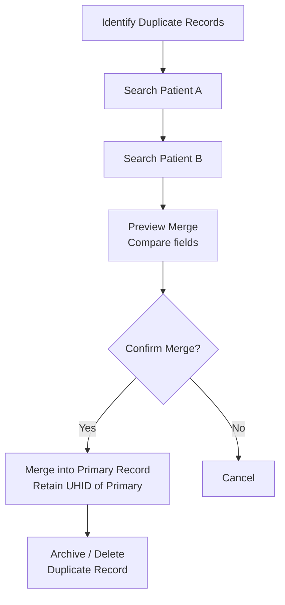

### 5.7 Medical Records

- Browse and manage patient medical history records
- Upload and attach documents
- Filter by patient, date range, record type

### 5.8 Health Packages

- Define and manage health check-up packages
- Package assignment to patients
- Bundled pricing and services

---

## 6. Inpatient Department (IPD)

The IPD module manages bed allocation, patient admission, forms, and discharge for all inpatient stays.

### IPD Core Workflow

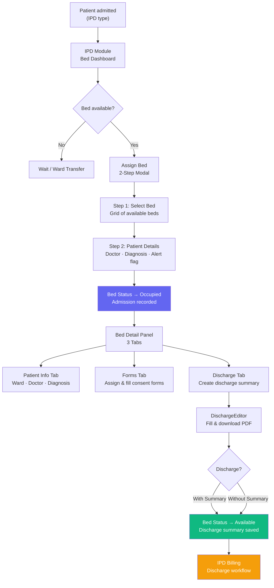

### Bed Status State Machine

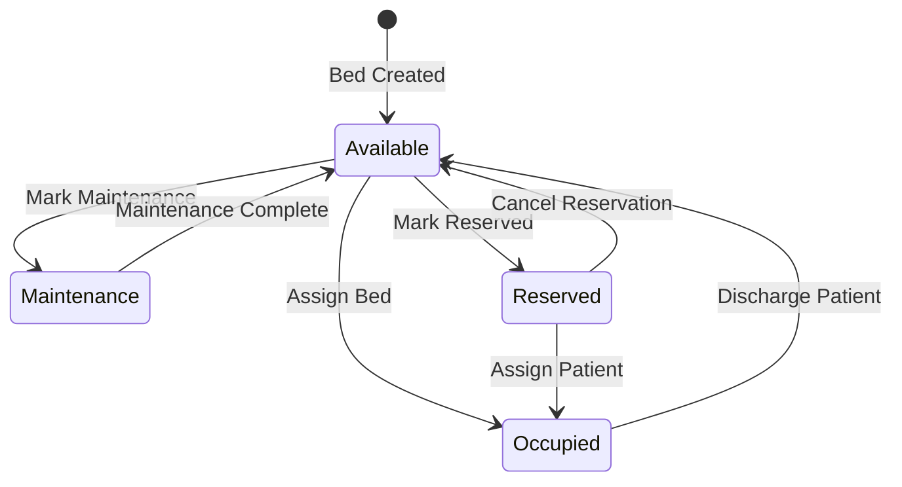

### 6.1 Bed Dashboard

- **Visual bed grid** — cards for every bed in the system
- Colour-coded by status:
  - 🟣 **Occupied** — patient name, age, doctor, diagnosis, admission date
  - 🟢 **Available** — click to open Assign Bed modal
  - 🔴 **Alert** — pulsing dot indicator for critical/alert beds
  - ⚙️ **Maintenance** — under maintenance label
  - 🟡 **Reserved** — reserved label
- **Quick Stats** (4 cards): Total Beds, Occupied, Available, Maintenance
- **Overall Occupancy** progress bar with percentage
- **Ward filter** tabs: All, ICU, General, Cardiology, Obs & Gyn, Neurology, Orthopedic, Pediatrics, Emergency

### 6.2 Add Bed

- Bed ID (unique, auto-uppercased)
- Ward selection
- Bed type: General / ICU / Private / Semi-Private / Maternity / Pediatric / Emergency
- Initial status: Available / Maintenance / Reserved
- Duplicate ID validation

### 6.3 Assign Bed (2-Step Modal)

**Step 1 — Select Bed:** Grid of all available beds, filterable by ID/ward  
**Step 2 — Patient Details:** Patient search with live filter, attending doctor, diagnosis, critical flag

### 6.5 Patient Discharge

- One-click bed release with or without discharge summary
- Bed status automatically reverts to "Available" on discharge
- Discharge summary workflow tracked through the IPD Billing discharge queue

---

## 7. Ward Management

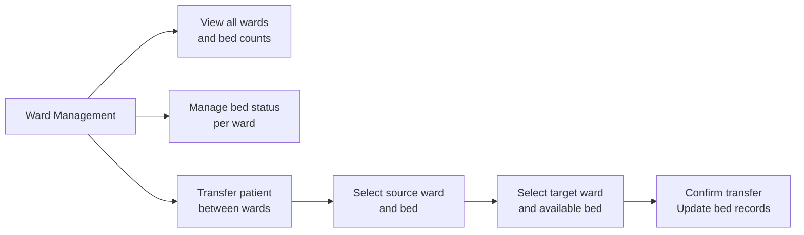

---

## 8. Nursing Station

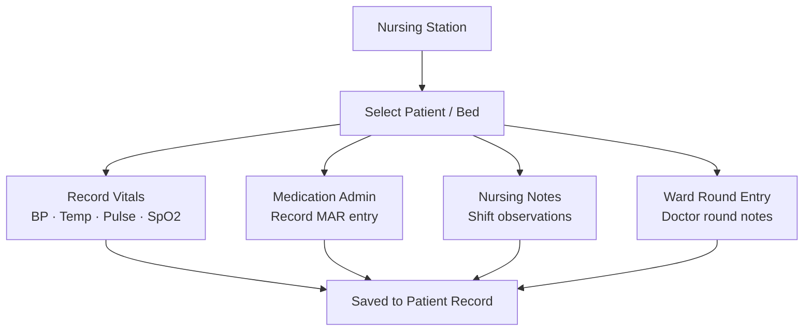

---

## 9. Emergency Module

### Emergency Triage Workflow

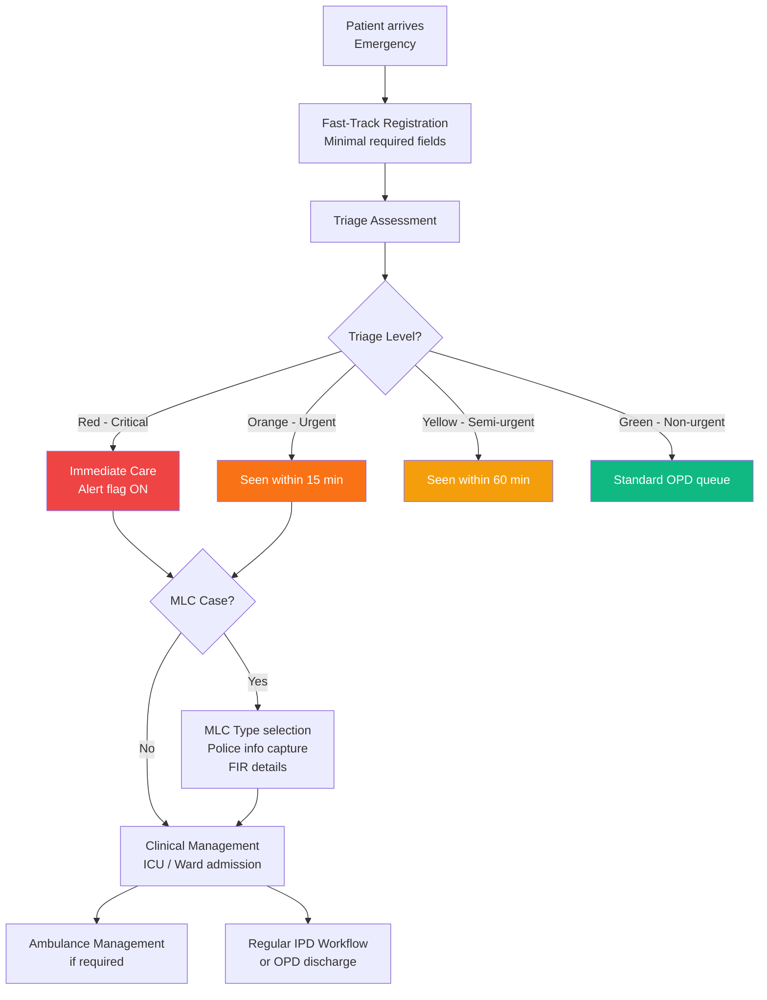

---

## 10. Appointments & Scheduling

### Appointment Booking Flow

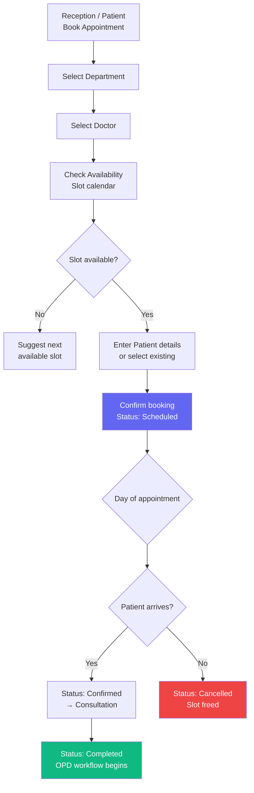

---

## 11. Clinical Modules

### 11.1 Doctors Workbench

- Doctor-specific patient list and worklist
- Clinical notes creation and signing
- Order management (lab, radiology, pharmacy)
- Access to patient forms and discharge summaries

### 11.2 Clinical Notes

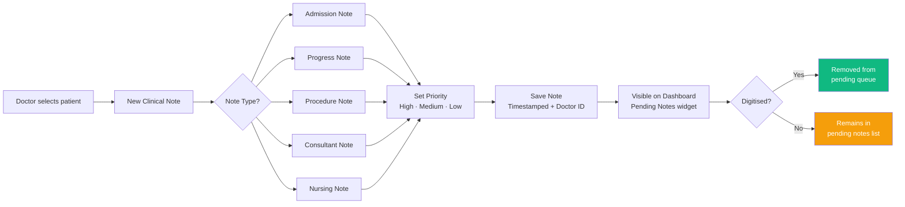

### 11.3 CPOE (Computerised Physician Order Entry)

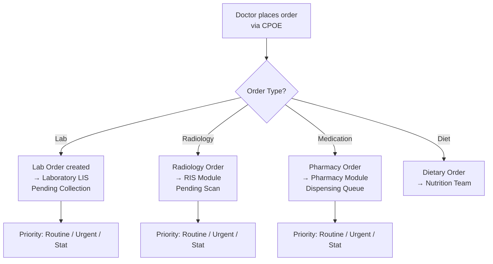

### 11.4 Discharge Summary Workflow

```mermaid
flowchart TD
    A["Admin uploads\ndischarge template PDF/HTML"] --> B["Template saved\nto library"]
    B --> C["Doctor selects template\nfor patient from IPD/Patient panel"]
    C --> D["DischargeEditor opens\nRich-text HTML editor"]
    D --> E["Auto-fill patient data\nName · UHID · Age · Gender\nDoctor · Department\nAdmission & Discharge dates\nBed ID"]
    E --> F["Doctor edits\nDiagnosis · Medications\nInstructions · Follow-up"]
    F --> G["Save to server\nStatus: In Progress"]
    G --> H["Download as PDF\nvia html2pdf.js"]
    H --> I["Status: Completed"]

    style E fill:#0ea5e9,color:#fff
    style I fill:#10b981,color:#fff
```

### 11.5 Patient Forms & Consent Management

#### FormViewer — PDF Annotation Engine

```mermaid
flowchart TD
    A["Admin uploads\nForm Template PDF"] --> B["Template saved\nto library with category"]
    B --> C["Doctor / Nurse assigns\ntemplate to patient"]
    C --> D["Patient form instance\ncreated on server"]
    D --> E["FormViewer opens\nFull-screen PDF viewer"]
    E --> F{Annotation Type?}
    F -->|Checkbox| G["Click to toggle ✓/☐"]
    F -->|Text Field| H["Click to type inline\non PDF"]
    F -->|Signature| I["Name-as-signature\ninsertion"]
    G & H & I --> J["Annotations saved\nto server as JSON"]
    J --> K["Status: In Progress"]
    K --> L["All fields complete?"]
    L -->|Yes| M["Status: Completed"]
    L -->|No| K

    style E fill:#6366f1,color:#fff
    style M fill:#10b981,color:#fff
```

---

## 12. Laboratory Information System (LIS)

### Lab Order Complete Workflow

```mermaid
flowchart TD
    A["Doctor places\nLab Order via CPOE or LIS"] --> B["Order created\nStatus: Pending"]
    B --> C["Sample Collection\nStatus: In Progress"]
    C --> D["Lab technician\nopens Result Panel"]
    D --> E{Test in catalog?}
    E -->|Yes| F["Structured parameter entry\nper test parameter\nReference range displayed"]
    E -->|No| G["Free-text result notes"]
    F --> H["Automatic HIGH/LOW\nflag detection"]
    H --> I["Save Results\nStatus: Completed"]
    G --> I
    I --> J["PDF Report\nauto-generated"]
    J --> K{Delivery method?}
    K -->|Download| L["jsPDF report\ndownloaded by user"]
    K -->|Email| M["PDF attached\nSent via Nodemailer"]
    K -->|External PDF| N["Upload scanned\nexternal PDF"]

    style I fill:#10b981,color:#fff
    style J fill:#6366f1,color:#fff
```

### Lab Report PDF Structure

```mermaid
flowchart TD
    PDF["Lab Report PDF"] --> H["Header\nHospital logo + name + tagline\n--- OR --- full-image header"]
    PDF --> T["Report Title\nLABORATORY TEST REPORT"]
    PDF --> P["Patient Info Box\nName · ID · Doctor · Date"]
    PDF --> IT["Investigation Title"]
    PDF --> RT["Results Table\nParameter | Result | Flag | Unit | Reference Range"]
    PDF --> FT["Footer\nLab director · Accreditation\n--- OR --- full-image footer"]
    PDF --> PN["Page Numbers"]

    RT --> F1["🔴 HIGH flag → Red text"]
    RT --> F2["🟡 LOW flag → Amber text"]
    RT --> F3["Normal → Default text"]
```

### 12.1 Lab Order Management

- Create new lab orders linked to patient and requesting doctor
- **Test catalog** — 50+ Indian standard lab tests pre-configured:

| Category | Tests (examples) |
|---|---|
| Haematology | CBC, ESR, PT/INR, APTT, D-Dimer, G6PD |
| Biochemistry | LFT, KFT, Lipid Profile, Blood Sugar (Fasting/PP/Random), ABG, Amylase, Lipase |
| Pathology | Thyroid Profile, HbA1c, Vitamin D, B12, Tumour Markers (PSA, CEA, CA125, CA19-9, AFP) |
| Microbiology | Widal, Dengue NS1/IgG/IgM, Malaria Antigen, HIV, HBsAg, HCV, VDRL, Cultures |
| Immunology | CRP, RA Factor, ASO Titre |
| Cardiology | Cardiac Enzymes (Troponin I/T, CPK, CPK-MB, LDH) |

- **Priority levels:** Routine / Urgent / Stat
- Status tracking: Pending → In Progress → Completed

### 12.2 Result Entry

- Structured parameter entry per test (input field per parameter)
- Normal range display for each parameter
- Automatic **HIGH / LOW flag** detection (numeric comparison to reference range)
- Results saved as JSON to server

### 12.4 External PDF Upload

- Upload manually scanned/external lab result PDFs
- Replace/update uploaded PDF per order
- View uploaded PDF via direct link

---

## 13. Radiology Information System (RIS)

### Radiology Workflow

```mermaid
flowchart TD
    A["Doctor orders\nRadiology investigation"] --> B["Order created in RIS\nStatus: Pending"]
    B --> C["Radiographer\nperforms scan/study"]
    C --> D["Radiologist\nreviews and reports"]
    D --> E{Report entry method?}
    E -->|Typed report| F["Enter report in RIS\nStatus: Reported"]
    E -->|Scanned PDF| G["Upload PDF report\nExternal/PACS"]
    F --> H["Doctor reviews\nresult in CPOE/RIS"]
    G --> H
    H --> I["Report available\nfor download/sharing"]
```

- Radiology order creation (linked to patient and doctor)
- Investigation types: X-Ray, CT Scan, MRI, Ultrasound, ECG, Echo, etc.
- Report management and status tracking
- **PACS integration** support (integration point)
- PDF upload for radiology reports
- Report viewing and download

---

## 14. Pharmacy Management

### Pharmacy Dispensing Workflow

```mermaid
flowchart TD
    A["Prescription received\nfrom CPOE or doctor"] --> B["Pharmacist reviews\nprescription"]
    B --> C{Drug in stock?}
    C -->|Yes| D["Pick and pack drugs\nfor dispensing"]
    C -->|No| E["Low stock alert\nAlternative suggested"]
    D --> F["Drug dispensed\nto patient/ward"]
    F --> G["Inventory decremented\nauto-update"]
    G --> H["Pharmacy billing\ncharges added to patient bill"]
    E --> I["Purchase order\nto replenish stock"]
```

---

## 15. Blood Bank

### Blood Bank Workflow

```mermaid
flowchart TD
    BB["Blood Bank Module"] --> A["Donor Management\nNew donor registration\nDonation history"]
    BB --> B["Blood Inventory\nTracking by blood group\nA+ A- B+ B- AB+ AB- O+ O-"]
    BB --> C["Blood Request\nLinked to patient\nBlood group + component"]

    C --> D["Compatibility check\nCheck inventory"]
    D --> E{Available?}
    E -->|Yes| F["Allocate unit\nIssue to ward/OT"]
    E -->|No| G["Notify: Request\nexternal supply"]
    F --> H["Inventory decremented\nTransfusion recorded"]

    B --> I["Components tracked\nWhole Blood · Packed RBCs\nPlatelets · FFP · Cryo"]
```

---

## 16. Operation Theatre (OT)

### OT Scheduling & Workflow

```mermaid
flowchart TD
    A["Surgery planned\nby surgeon"] --> B["OT Scheduling\nDate · Time · OT room"]
    B --> C["Pre-operative checklist\nCompleted by nurse"]
    C --> D["Patient shifted to OT"]
    D --> E["Anaesthesia Notes\nAnaesthesiologist records"]
    E --> F["Intra-operative Notes\nSurgeon notes OT findings"]
    F --> G["Surgery completed\nOT room freed"]
    G --> H["Post-operative Notes\nRecovery room monitoring"]
    H --> I["Patient shifted to\nward / ICU"]
    I --> J["OT charges added\nto IPD billing"]
```

---

## 17. Billing & Revenue Cycle

### Overall Billing Architecture

```mermaid
flowchart TD
    Patient["Patient Services"] --> OPD_B["OPD Billing\nOutpatient invoice"]
    Patient --> IPD_B["IPD Billing\nInpatient discharge billing"]
    Patient --> LAB_B["Lab Billing\nTest charges"]
    Patient --> PHAR_B["Pharmacy Billing\nDrug charges"]
    Patient --> RAD_B["Radiology Billing\nScan charges"]

    OPD_B --> PM["Payment Methods\nCash · Card · UPI\nInsurance · Cheque · NEFT"]
    IPD_B --> DW["Discharge Workflow\n6-step clearance"]
    DW --> PM

    PM --> S{Payment status?}
    S -->|Full payment| Paid["Status: PAID ✅"]
    S -->|Partial| Partial["Status: PARTIAL"]
    S -->|Unpaid| Pending["Status: PENDING"]

    IPD_B --> TPA["TPA / Insurance\nClaim submission"]
    TPA --> Audit["Medical + Technical\nAudit trail"]

    style Paid fill:#10b981,color:#fff
    style Partial fill:#6366f1,color:#fff
    style Pending fill:#f59e0b,color:#fff
```

### 17.2 IPD Discharge Billing — 6-Step Workflow

```mermaid
flowchart LR
    S0["🏥 Discharge Advised"] --> S1["📋 Clinical Summary\nDoctor signs off"]
    S1 --> S2["💊 Pharmacy Clearance\nAll drugs billed"]
    S2 --> S3["🧪 Lab Clearance\nAll tests billed"]
    S3 --> S4["🧾 Final Billing\nConsolidate all charges"]
    S4 --> S5["✅ Settle & Vacate\nPayment collected\nBed released"]

    style S0 fill:#6366f1,color:#fff
    style S5 fill:#10b981,color:#fff
```

### 17.3 TPA / Insurance Management

```mermaid
flowchart TD
    A["Patient with Insurance\nregistered at admission"] --> B["Pre-authorisation\nrequest submitted"]
    B --> C["TPA / Insurance company\napproves / queries"]
    C -->|Approved| D["Admitted with\ninsurance coverage"]
    C -->|Query| E["Medical team\nresponds to query"]
    E --> C
    D --> F["Services rendered\ncharges tracked"]
    F --> G["Discharge & Final Bill\ncreated"]
    G --> H["Claim submission\nto TPA"]
    H --> I["Medical Audit\ndocumentation"]
    H --> J["Technical Audit\ndocumentation"]
    I & J --> K["Claim settlement\nPayment received"]
```

### 17.1 OPD Billing

- Generate invoices for outpatient consultations
- **Billing types:** OPD, IPD, Lab, Pharmacy
- **Payment methods:** Cash, Card, UPI, Insurance, Cheque, NEFT
- Invoice status: Paid / Pending / Partial / Overdue
- Mark as Paid functionality
- Invoice detail modal with total/paid/balance breakdown
- Download PDF invoice button
- **Summary stats:** Total invoices, Revenue Collected, Pending Amount, Partial Payments

---

## 18. Inventory Management

### Inventory Flow

```mermaid
flowchart TD
    IM["Inventory Management"] --> A["Stock Master\nItem catalogue\nMedicines · Consumables · Equipment"]
    IM --> B["Purchase Orders\nCreate PO to vendor"]
    B --> C["Goods Receipt\nVerify and receive stock"]
    C --> D["Stock Levels updated\nauto-increment"]
    D --> E{Below reorder level?}
    E -->|Yes| F["Low Stock Alert\nNotify stores manager"]
    F --> B
    E -->|No| G["Normal operation\nDispensing allowed"]

    IM --> H["Vendor Management\nSupplier master records"]
    IM --> I["Reports\nCurrent stock\nMovement report\nValuation"]
```

---

## 19. Staff Management *(Admin Only)*

### Staff Lifecycle

```mermaid
flowchart TD
    A["Admin creates\nstaff account"] --> B["Set Name · Email · Role\nDepartment · Designation"]
    B --> C{Role assigned?}
    C -->|Admin| D["Full system access\nincluding admin modules"]
    C -->|Staff| E["Operational access\nno admin modules"]
    D & E --> F["Staff receives\nlogin credentials"]
    F --> G["Staff logs in\nJWT issued"]
    G --> H["Active staff member\nAudit trail maintained"]
    H --> I{Status change?}
    I -->|Inactive| J["Account deactivated\nLogin blocked"]
    I -->|Active| H
```

- Staff registration (doctors, nurses, administrative staff, lab technicians, etc.)
- Role assignment (Admin / Staff)
- Department allocation
- Staff profile management
- Active / inactive status control

---

## 20. Settings & Hospital Configuration

### Settings Module Structure

```mermaid
flowchart TD
    S["Settings Module"] --> A["Hospital Profile\nName · Address · Phone\nEmail · Registration No · Logo"]
    S --> B["Report Branding\nPrint mode: Text/Logo or Image"]
    B --> B1["Text/Logo Mode\nHeader text · Tagline\nLogo upload · Footer text"]
    B --> B2["Image Mode\nHeader image upload\nFooter image upload"]
    S --> C["Department Management\nAdd · Edit · Remove departments"]
    S --> D["Doctor Management\nProfiles · Department · Status"]

    B1 --> E["Affects PDF output\nLab Reports · Discharge Summaries"]
    B2 --> E
```

### Report Branding Decision Tree

```mermaid
flowchart TD
    PDF["Generate PDF Report"] --> Q{report_print_mode?}
    Q -->|image| H1["Embed full header image\nacross page width"]
    Q -->|text| H2["Render hospital name\ntagline · logo from settings"]
    H1 & H2 --> BODY["Report Body\nPatient info · Results table"]
    BODY --> Q2{Footer mode?}
    Q2 -->|image| F1["Embed full footer image\nat page bottom"]
    Q2 -->|text| F2["Render footer text\npage numbers"]
    F1 & F2 --> DONE["Final PDF ready"]

    style DONE fill:#10b981,color:#fff
```

---

## 21. Form Templates *(Admin Only)*

### Template Management Flow

```mermaid
flowchart LR
    A["Admin uploads\nPDF form template"] --> B["Set name + category\nGeneral · Consent · Assessment\nDischarge · Nursing · ICU · OT · Emergency"]
    B --> C["Template saved\nto file storage"]
    C --> D["Available in\nAssign Template list\nfor all patients"]
    D --> E["Doctor/Nurse assigns\ntemplate to patient"]
    E --> F["Patient form instance\ncreated with empty annotations"]
    F --> G["FormViewer opened\nfor annotation"]
```

---

## 22. Audit Log *(Admin Only)*

### Audit Trail Coverage

```mermaid
flowchart LR
    System["System Actions"] --> AL["Audit Log\nTimestamped + User ID"]

    subgraph Events logged
        direction TB
        P["Patient created/updated"]
        B["Bed assigned/released"]
        L["Lab order/result"]
        Bi["Bill generated/paid"]
        F["Form assigned/completed"]
        U["User login/logout"]
        Se["Settings changed"]
        St["Staff added/modified"]
    end

    AL --> Events logged
    AL --> Filter["Filter by\nDate range · User · Module · Action"]
    Filter --> View["Tabular view\nTimestamp · User · Action · Details"]
```

---

## 23. Reports & MIS

### Reports Module Architecture

```mermaid
flowchart TD
    R["Reports & MIS Module"] --> A["MIS Dashboard\nHospital KPI overview\nLive metrics"]
    R --> B["MIS Reports\nExportable data reports"]
    R --> C["Revenue Analytics\nRevenue trend\nDept-wise collections\nInsurance vs cash"]
    R --> D["Operational Reports\nBed occupancy\nAverage LOS\nOT utilisation\nLab TAT"]
    R --> E["Clinical Audit\nQuality metrics\nClinical outcomes"]

    B --> B1["Admissions report\nDischarge report\nOPD visits report"]
    C --> C1["Monthly revenue chart\n6-month trend\nDepartment breakdown"]
    D --> D1["Occupancy %\nAvg length of stay\nDepartment admissions"]
```

---

## 24. Technical Architecture

### Deployment Architecture

```mermaid
flowchart TD
    Browser["🌐 Browser"] -->|HTTPS| Nginx["Nginx / Reverse Proxy\nor Direct Vite Dev"]
    Nginx --> FE["React 18 Frontend\nVite build / HMR\nPort 5173 dev"]
    FE -->|REST API calls| BE["Express.js Backend\nNode.js\nPort: .env config"]
    BE --> DB["PostgreSQL\nDatabase"]
    BE --> FS["File Storage\n/server/uploads/\nPDFs · Images · Logos"]
    BE --> Email["Nodemailer\nSMTP Email\nLab report delivery"]

    subgraph Docker
        FE
        BE
        DB
    end
```

### Frontend Tech Stack

| Component | Technology |
|---|---|
| Framework | React 18 with Vite |
| Routing | React Router v6 |
| Charts | Recharts (Area, Bar, Pie) |
| Icons | Lucide React |
| PDF Generation | jsPDF + jsPDF-AutoTable, html2pdf.js |
| PDF Rendering | pdfjs-dist |
| QR Code | html5-qrcode |
| State Management | React Context (AuthContext) |
| Styling | Vanilla CSS with CSS custom properties |

### Backend Tech Stack

| Component | Technology |
|---|---|
| Runtime | Node.js |
| Framework | Express.js |
| Database | PostgreSQL |
| Auth | JWT (jsonwebtoken) + bcrypt |
| File Storage | Local filesystem (`/server/uploads/`) |
| Email | Nodemailer (SMTP) |

### Database Entity Relationship (Key Tables)

```mermaid
erDiagram
    PATIENTS {
        string id PK
        string name
        int age
        string gender
        string blood_group
        string department
        string doctor_id FK
        string status
        string admission_type
        string payment_type
    }
    BEDS {
        string id PK
        string ward
        string bed_type
        string status
        string patient_id FK
        string doctor_id FK
        string diagnosis
    }
    LAB_ORDERS {
        int id PK
        string patient_id FK
        string test_name
        string category
        string priority
        string status
        text result_notes
        string result_pdf_path
    }
    BILLING {
        int id PK
        string patient_id FK
        float total_amount
        float paid_amount
        string status
        string payment_method
        string type
    }
    PATIENT_FORMS {
        int id PK
        int template_id FK
        string patient_id FK
        text annotations
        string status
    }
    FORM_TEMPLATES {
        int id PK
        string name
        string category
        string file_path
    }
    DISCHARGE_SUMMARIES {
        int id PK
        int template_id FK
        string patient_id FK
        text html_content
        string status
    }

    PATIENTS ||--o{ BEDS : "assigned to"
    PATIENTS ||--o{ LAB_ORDERS : "has"
    PATIENTS ||--o{ BILLING : "billed"
    PATIENTS ||--o{ PATIENT_FORMS : "assigned"
    PATIENTS ||--o{ DISCHARGE_SUMMARIES : "has"
    FORM_TEMPLATES ||--o{ PATIENT_FORMS : "used by"
```

### Data Flow — End-to-End Patient Visit

```mermaid
sequenceDiagram
    participant Reception
    participant PatientDB as Patient DB
    participant Doctor
    participant Lab
    participant Pharmacy
    participant Billing

    Reception->>PatientDB: Register patient (UHID generated)
    Reception->>PatientDB: Assign bed (IPD)
    Doctor->>PatientDB: Write clinical note
    Doctor->>Lab: Place lab order (CPOE)
    Lab->>PatientDB: Save results + generate PDF
    Doctor->>Pharmacy: Place prescription
    Pharmacy->>PatientDB: Record dispensing
    Doctor->>PatientDB: Create discharge summary
    Billing->>PatientDB: Consolidate all charges
    Billing->>PatientDB: Generate final invoice
    Reception->>PatientDB: Collect payment → Bed released
```

---

*Document prepared from codebase analysis of the SwasthyaSync HMS project.*  
*© 2026 SwasthyaSync. All rights reserved.*
